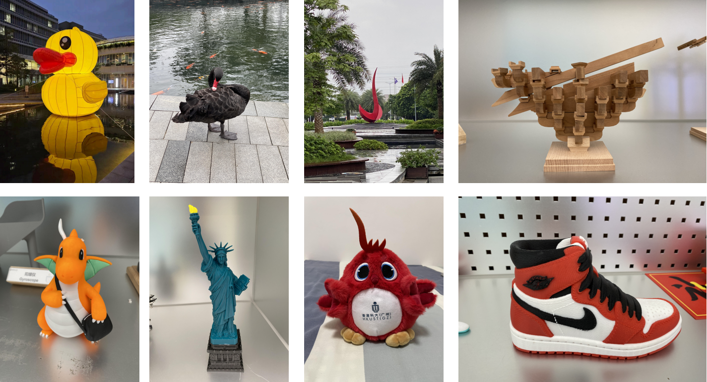
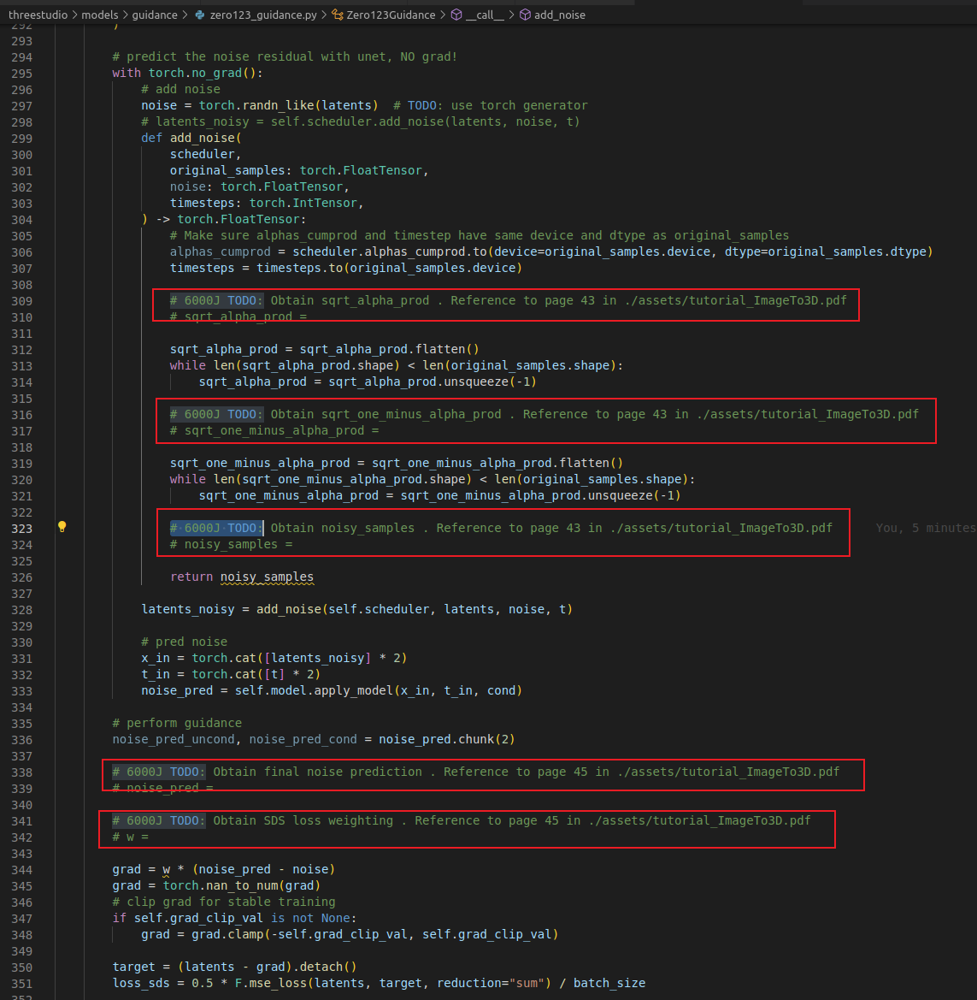
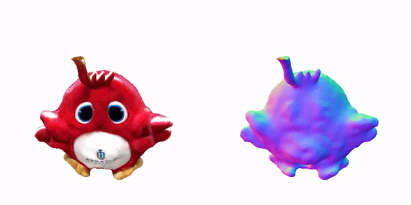

<p align="center">
  <b>ROAS6000J Project: Image/Text to 3D generation.</b>
  <br/>
  
</p>

## Contact
- TA: swang457@connect.hkust-gz.edu.cn


## Codebase includes:
- The basic pipeline for Image/Text to 3D generation for objects, excluding the core implementation of the diffusion model.
- Evaluation dataset.
- Dataset preprocessed code.
- Evaluation code for 3D generation model.

## Basic Requirement
- Complete **core implementation** of diffusion model.
- Compare the performance of different methods on the same evaluation dataset, which should include:
  - **At least three open-source methods**. Some open-source methods have been listed as followning, and the methods are not limited in theses listed ones. 
  
  - **Note**: you can use Threestudio to evaluate different methods in a unified framework.
    - Threestudio https://github.com/threestudio-project/threestudio
    - DreamFusion https://dreamfusion3d.github.io/
    - Magic3D https://research.nvidia.com/labs/dir/
    - Fantasia3D https://fantasia3d.github.io/
    - DreamGaussian https://dreamgaussian.github.io/
    - RealFusion https://lukemelas.github.io/realfusion/
    - NeRDi https://arxiv.org/abs/2212.03267
    - NeuralLift-360 https://vita-group.github.io/NeuralLi
    - NFSD https://orenkatzir.github.io/nfsd/
    - ProlificDreamer https://ml.cs.tsinghua.edu.cn/prolifi
    - Zero-1-to-3 https://zero123.cs.columbia.edu/
    - Magic123 https://guochengqian.github.io/projec
    - DreamCraft3D https://mrtornado24.github.io/DreamCr
    - SyncedDreamer https://liuyuan-pal.github.io/SyncDre
    - MVDreamer https://mv-dream.github.io/
    - Consistent-1-to-3 https://jianglongye.com/consistent123/
    - zero123++ https://arxiv.org/abs/2310.15110
    - Wonder3D https://www.xxlong.site/Wonder3D/
    - SweetDreamer https://sweetdreamer3d.github.io/
    - LRM https://scalei3d.github.io/LRM/
    - Instant3D https://instant-3d.github.io/
    - DMV3D https://openreview.net/forum?id=H4yQe
    - CraftsMan https://github.com/wyysf-98/CraftsMan

  - **At least two closed-source methods**. Some close-source methods have been listed as followning, and the methods are not limited in theses listed ones:
    - CLAY https://github.com/CLAY-3D/OpenCLAY
    - Tripo3D https://www.tripo3d.ai/ 
    - One2345plus https://sudo-ai-3d.github.io/One2345plus_page
    - Meshy  https://www.meshy.ai/
- For open-source methods, **adjust various hyperparameters** (such as text prompts, classification guidance scales, elevation angles, and physical properties) to compare generation results and summarize evaluation outcomes.

## Advanced Requirement
- **Different 3D Representations**: We encourage you to investigate and implement various advanced 3D representations beyond the conventional Neural Radiance Fields (NeRF). This exploration could include experimenting with cutting-edge techniques like Triplane representation from EG3D, Gaussian volumetric models as detailed in Gaussian Splatting, or 3D diffusion model which can be found at CraftsMan. An interesting example is CraftsMan, which employs a 3D native diffusion model based on your inputs, potentially offering coarse geometries in seconds  and more nuanced control over normal-based geometry refiner.
- **3D Generation Enhancement**: Despite significant advancements, existing methods still struggle with distorted shapes and noisy surfaces. Explore incorporating more information or prior knowledge to enhance the coarse results from the first stage of generation. For example, include more observing views from a video sequence to improve side or back generation results, or incorporate advanced foundation models, such as image-to-normal models, to refine geometry.
- **Train or Fine-Tune a Personalized 3D Generation Model**: From evaluating different methods, you may notice that state-of-the-art (SOTA) methods do not satisfy your requirements for specific categories, such as a particular dog, car, or a personalized subject. Explore training or fine-tuning a personalized 3D generation model.
- **Free your mind**: Reward will be given for every unique exploration.

## News
- 12/Oct/2024: First version.


## Installation


The following steps have been tested on Ubuntu20.04.

- You must have an NVIDIA graphics card with at least 24GB VRAM and have [CUDA](https://developer.nvidia.com/cuda-downloads) installed.
- Create a conda environment:

```sh
conda create --name ImageTo3D python=3.9
conda activate ImageTo3D
python -m pip install --upgrade pip
```

- Install `PyTorch`. We have tested on `torch2.0.1+cu118`, but other versions should also work fine.

```sh
# torch2.0.1+cu118
conda install pytorch==2.0.1 torchvision==0.15.2 torchaudio==2.0.2 pytorch-cuda=11.8 -c pytorch -c nvidia
```

- (Optional, Recommended) Install ninja to speed up the compilation of CUDA extensions:

```sh
pip install ninja
```

- Install pytorch lightning:

```sh
conda install lightning==2.3.0 -c conda-forge
```

- Install dependencies:

```sh
pip install -r requirements.txt
```

- Install ffmpeg:

```sh
sudo apt install ffmpeg
```

Download pretrained Zero123XL weights into `load/zero123`:

```sh
cd load/zero123
wget https://zero123.cs.columbia.edu/assets/zero123-xl.ckpt
```

## Evaluation Dataset

All the methods should be evaluated on the supplied dataset which locates in `./dataset`
<p align="center">
    
</p>

## Dataset preprocessed code
  To prepare input images for 3D generation models:
  - **Background Removal**: Use tools like remove.bg https://www.remove.bg/. For example, ./dataset/cute_bird.jpg becomes ./dataset/cute_bird-removebg-preview.png: 

  <p align="center">
      
  </p>

  - **Center and Crop:** Run:
  ```sh
  python common/dataset.py --image_in_f dataset/cute_bird-removebg-preview.png --image_out_f dataset/cute_bird_processed.png crop_size
  ```
  Resulting image ./dataset/cute_bird_processed.png:

  <p align="center">
      
  </p>  


## Core implementation of diffusion model.
After obtaining `cute_bird_processed.png` in the preprocessed folder, follow the steps below to generate the 3D model:

  ```sh
  export NAME=cute_bird_processed
  #  obtain 3D model
  python launch.py --config configs/zero123.yaml --train data.image_path=./dataset/${NAME}.png use_timestamp=False name=${NAME} tag=Phase1
  # export *.obj mesh file in `outputs/cute_bird_processed/Phase1/save/it600-export/`
  python launch.py --config outputs/cute_bird_processed/Phase1/configs/parsed.yaml --export resume=./outputs/cute_bird_processed/Phase1/ckpts/last.ckpt system.exporter_type=mesh-exporter
  ```
`Note`: The commands above will not work if the core code of the diffusion model is incomplete. To meet the basic requirements, ensure the core code is fully implemented. You can refer to `./assets/tutorial_ImageTo3D.pdf` for guidance on completing the code.

The incomplete code sections can be found in `threestudio/models/guidance/zero123_guidance.py`. Look for comments starting with `# 6000J TODO:` for the parts that require your attention.
  <p align="center">
      
  </p>  


## Evaluation code for 3D generation model.
To evaluate a 3D model represented by a *.obj file, generate a 360-degree video showing appearance and normal maps. Use the reference code in ./common/evaluation.py.

Example command::
  ```sh
  python common/evaluation.py --object_mesh_f dataset/cute_bird_export/model.obj --image_numbers 60 --camera_distance 2.0 --out_dir outputs/cute_bird/
  ```
Example output:

<p align="center">
  <br/>
  
</p>
